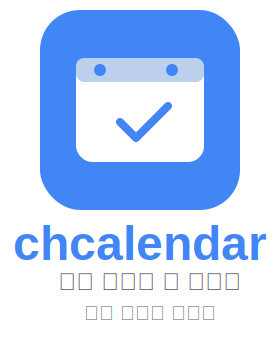

<h1 align="center">🚀 chcalendar 🖥️</h1>

  

사이트 링크: https://chcalendar.site/

# 서비스 소개
chcalendar는 그룹 일정 통합 관리 서비스로, 전체 그룹 일정을 한눈에 관리하고 원하는 멤버만 일정에 초대할 수 있는 기능을 제공하여 그룹 일정을 효율적으로 관리할 수 있도록 지원합니다.

그룹내에서 원하는 사람들끼리 일정을 가질 때나, 여러 그룹의 모임을 참여하는 경우 한 캘린더 앱에서 관리하기에 불편함을 느꼈습니다. 이에 대한 요구를 충족시키기 위해서, 그룹에서 원하는 멤버만 일정에 초대할 수 있는 기능과, 전체 그룹 일정과 개인 일정을 한눈에 파악할 수 있는 일정 통합 관리 기능을 개발하게 되었습니다. 

# 주요 기능
**유저 및 회원**
- 로그인, 로그아웃 [PR #11](https://github.com/chanheess/calendar/pull/11)
- 회원가입, 이메일 인증 [PR #11](https://github.com/chanheess/calendar/pull/11)
- 프로필, 비밀번호 변경 [PR #11](https://github.com/chanheess/calendar/pull/11)
- 이메일 인증으로 비밀번호 초기화 [PR #33](https://github.com/chanheess/calendar/pull/33)
- 비밀번호 5회 이상 틀릴시 30분후 시도 가능하도록 처리 [PR #40](https://github.com/chanheess/calendar/pull/40)
 블로그 링크: [이메일 인증을 위한 Redis 설정과 문제 해결 과정](https://chanheess.tistory.com/271)

**캘린더**
- 일, 주, 월 단위로 캘린더 보기
    - 페이징으로 나눠서 캘린더 데이터를 가져오기 [PR #42](https://github.com/chanheess/calendar/pull/42/commits/1b451481a7df7af394fd1fd7bb2524173e0fc51e)
- 캘린더 일정 작성 [PR #9](https://github.com/chanheess/calendar/pull/9)
- 캘린더별 색상 지정 [PR #52](https://github.com/chanheess/calendar/pull/52)
- 반복 일정 작성 [PR #8](https://github.com/chanheess/calendar/pull/8)
- 그룹 캘린더로 다른 사용자가 같은 캘린더에서 일정 작성 [PR #18](https://github.com/chanheess/calendar/pull/18)
- 그룹 캘린더에 초대하기 [PR #18](https://github.com/chanheess/calendar/pull/18)
- 그룹 캘린더에서 개별 인원에 대해서 일정 초대 [PR #58](https://github.com/chanheess/calendar/pull/58)
- 그룹 캘린더에서 일정에 대해 수락 거부 [PR #58](https://github.com/chanheess/calendar/pull/58)

**알림**
- 사이트 내 기본 알림 (초대 알림)
- FCM 사용한 브라우저 푸시 알림 처리 [PR #42](https://github.com/chanheess/calendar/pull/42)
- Quartz에 등록해서 알림 예약 발송 [PR #42](https://github.com/chanheess/calendar/pull/42)
 블로그 링크: [빌드 실패 디버깅](https://chanheess.tistory.com/278)

**인증 인가**
- jwt 토큰으로 로그인 처리 [PR #11](https://github.com/chanheess/calendar/pull/11)
 블로그 링크: [Spring Security, JWT을 사용하여 로그인 서비스 만들기](https://chanheess.tistory.com/258)

**인프라**
- Jenkins CI/CD
- EC2
- RDS
- Docker
- nginx
- redis
- SSH
 블로그 링크:  - [EC2를 활용한 HTTPS 및 도메인 설정](https://chanheess.tistory.com/274)
 - [CI/CD? 배포 자동화를 해보자](https://chanheess.tistory.com/275)

# 기술 스택 
`Java 17` `Spring Boot 3.3.1` `Spring 6.1.10` `Spring Security` `JPA` 
`MySQL` `Redis` 
`AWS EC2` `AWS RDS` `Docker` `Jenkins` `NGINX`

# ERD
 

