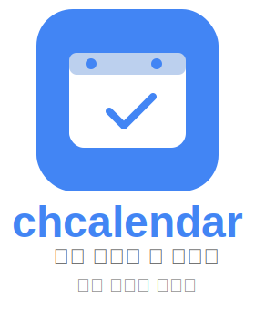

# chcalendar

  

Google 캘린더, 그룹 캘린더 등 다양한 캘린더를 한 번에 관리하고,  
중요한 일정은 푸시 알림으로 놓치지 마세요.  

## 🌐 서비스 소개  

chcalendar는 개인, 그룹, 구글 캘린더를 한곳에서 통합 관리할 수 있는 캘린더 서비스입니다.  
그룹 일정에서는 필요한 멤버만 초대하여 참석 여부를 확인하고, 역할 기반으로 효율적인 일정 공유와 협업이 가능합니다.
복잡한 일정도 한눈에 파악하고, 개인과 팀 모두에게 최적화된 일정 관리 경험을 제공합니다.

**chcalendar는 이렇게 시작됐습니다**  
여러 그룹에 소속되며 다양한 사람들과 일정을 조율할 때, 기존 캘린더 앱만으로는 불편함을 느꼈습니다.  
그룹 내에서 필요한 사람만 일정에 참여시키고, 개인 일정과 여러 그룹 일정들을 통합해서 관리할 수 있는 기능이 필요하다고 판단해 chcalendar를 개발하게 되었습니다.

- 📅 **개인 및 그룹 일정 통합 보기**  
  전체 그룹 일정을 개인 일정과 함께 한눈에 확인할 수 있습니다.

- 👥 **선택적 일정 초대**  
  그룹 내 원하는 멤버만 골라서 일정을 공유하고 관리할 수 있습니다.

- 🔁 **반복 일정 및 알림 기능**  
  주기적인 일정 등록과 알림 기능으로 중요한 일정을 놓치지 않고 확인할 수 있습니다.

> 일정 통합 관리가 필요한 개인, 동아리, 팀 단위 사용자에게 특히 유용한 서비스입니다.
 

# 주요 기능
**유저 및 회원**
- 로그인, 로그아웃 [PR #11](https://github.com/chanheess/calendar/pull/11)
- 회원가입, 이메일 인증 [PR #11](https://github.com/chanheess/calendar/pull/11)
- 회원탈퇴 [PR #114](https://github.com/chanheess/calendar/pull/114)
- 프로필, 비밀번호 변경 [PR #11](https://github.com/chanheess/calendar/pull/11)
- 이메일 인증으로 비밀번호 초기화 [PR #33](https://github.com/chanheess/calendar/pull/33)
- 비밀번호 5회 이상 틀릴시 30분후 시도 가능하도록 처리 [PR #40](https://github.com/chanheess/calendar/pull/40)
 블로그 링크: [이메일 인증을 위한 Redis 설정과 문제 해결 과정](https://chanheess.tistory.com/271)

**캘린더**
- 일, 주, 월 단위로 캘린더 보기
    - 페이징으로 나눠서 캘린더 데이터를 가져오기 [PR #42](https://github.com/chanheess/calendar/pull/42/commits/1b451481a7df7af394fd1fd7bb2524173e0fc51e)
- 캘린더 일정 작성 [PR #9](https://github.com/chanheess/calendar/pull/9)
- 캘린더별 색상 지정 [PR #52](https://github.com/chanheess/calendar/pull/52)
- 반복 일정 작성 [PR #8](https://github.com/chanheess/calendar/pull/8)
- 그룹 캘린더에서 일정 작성 [PR #18](https://github.com/chanheess/calendar/pull/18)
- 그룹 캘린더에 초대하기 [PR #18](https://github.com/chanheess/calendar/pull/18)
- 그룹 캘린더에서 그룹 일정 초대 [PR #58](https://github.com/chanheess/calendar/pull/58)
- 그룹 캘린더에서 그룹 일정 수락 거부 [PR #58](https://github.com/chanheess/calendar/pull/58)
- 그룹 캘린더에서 그룹 일정 권한 설정 [PR #114](https://github.com/chanheess/calendar/pull/114)
- 캘린더 탈퇴 [PR #114](https://github.com/chanheess/calendar/pull/114)

**알림**
- 사이트 내 기본 알림 (초대 알림)
- FCM 사용한 브라우저 푸시 알림 처리 [PR #42](https://github.com/chanheess/calendar/pull/42)
- Quartz에 등록해서 알림 예약 발송 [PR #42](https://github.com/chanheess/calendar/pull/42)
 블로그 링크: [빌드 실패 디버깅](https://chanheess.tistory.com/278)

**인증 인가**
- jwt 토큰으로 로그인 처리 [PR #11](https://github.com/chanheess/calendar/pull/11)
 블로그 링크: [Spring Security, JWT을 사용하여 로그인 서비스 만들기](https://chanheess.tistory.com/258)

**구글 연동**
- 구글 로그인 [PR #114](https://github.com/chanheess/calendar/pull/114)
- 구글 캘린더 연동 [PR #114](https://github.com/chanheess/calendar/pull/114)
- 구글 캘린더 일정 작성 [PR #114](https://github.com/chanheess/calendar/pull/114)
 연관 이슈: [Issue #101](https://github.com/chanheess/calendar/issues/101)
 블로그 링크: [데이터베이스 구조 리팩토링 및 마이그레이션 경험 공유](https://chanheess.tistory.com/280)

**그 외**
- 외부 메일주소 사용 [PR #131](https://github.com/chanheess/calendar/pull/131)
- 메인 서비스 소개 페이지 [PR #122](https://github.com/chanheess/calendar/pull/122)

**인프라**
- Jenkins CI/CD
- EC2
- RDS
- Docker
- nginx
- redis
- SSH
 블로그 링크:  - [EC2를 활용한 HTTPS 및 도메인 설정](https://chanheess.tistory.com/274)
 - [CI/CD? 배포 자동화를 해보자](https://chanheess.tistory.com/275)

# 기술 스택 
`Java 17` `Spring Boot 3.3.1` `Spring 6.1.10` `Spring Security` `JPA` 
`MySQL` `Redis` 
`AWS EC2` `AWS RDS` `Docker` `Jenkins` `NGINX`

# ERD
 

